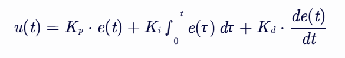
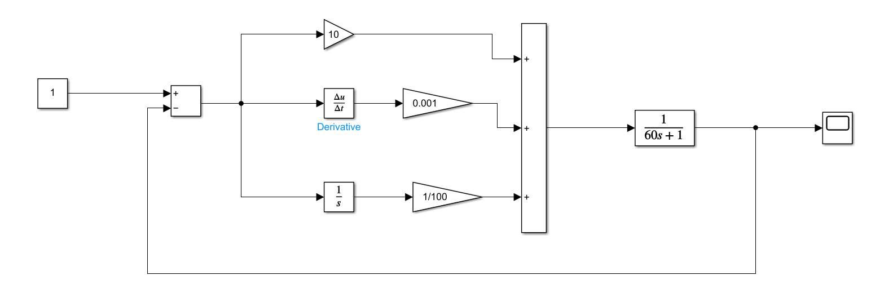
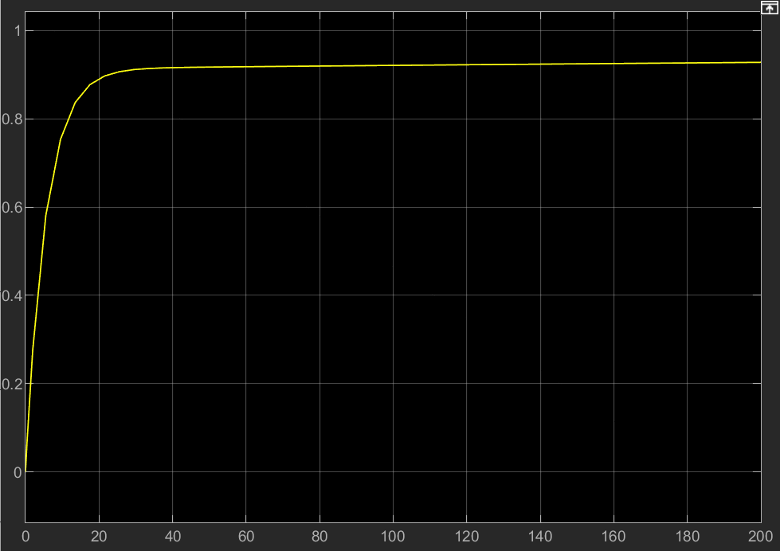
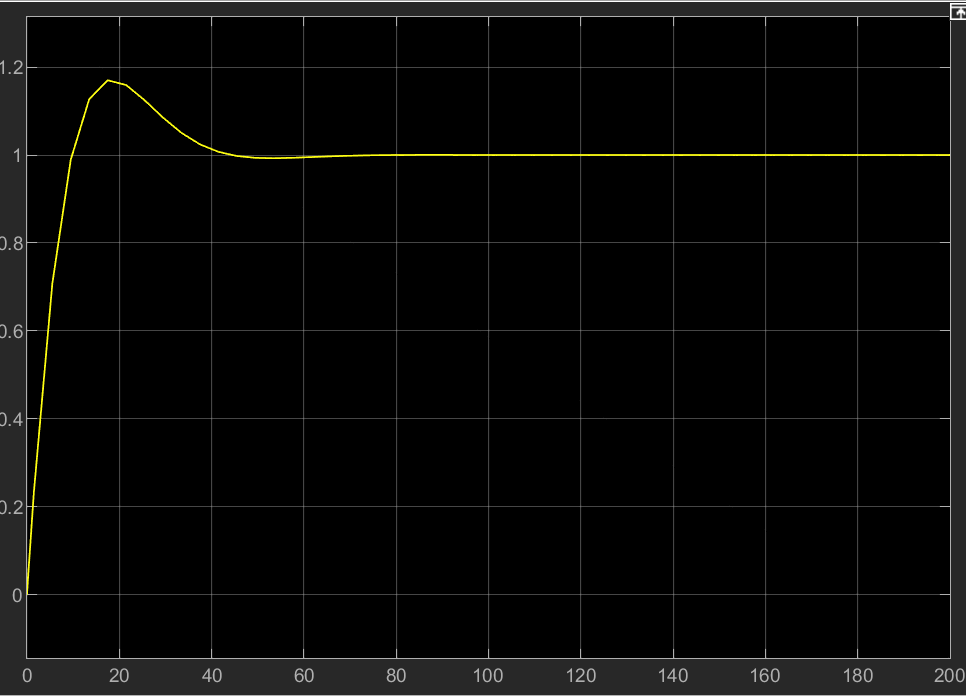
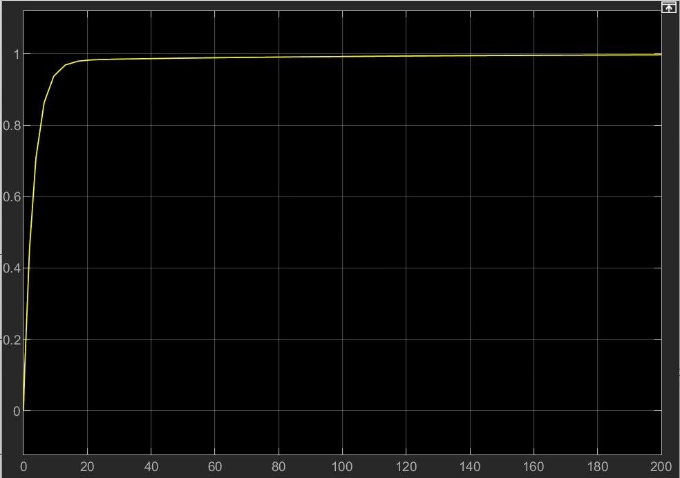
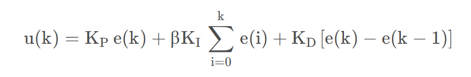
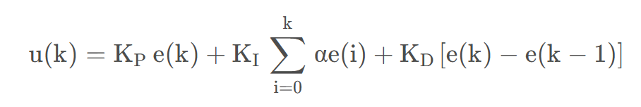
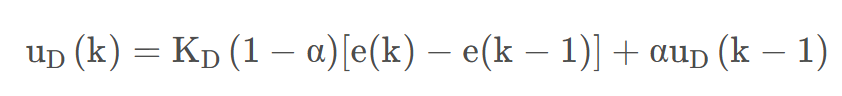

# [PID控制算法以及代码实现]
 
# 作者
## [机智流硬件]  [冷小莫]  
### [1412195676@qq.com]  
 
## 日期
[2024-12]
 
## 摘要
- PID控制算法是工业自动化中最常用的控制算法之一。
- PID通过计算当前输出与期望输出之间的误差，并根据该误差的比例（P）、积分（I）和微分（D）来调整控制输入，从而实现对系统的精确控制。
## 工作原理
PID控制器通过以下三个基本组件来计算控制输入：
- 比例（P）：直接对误差进行比例放大，可以迅速减少误差，但可能导致系统不稳定。
- 积分（I）：对误差进行积分，可以消除系统的静态误差，但可能导致系统响应变慢。
- 微分（D）：对误差的导数进行预测，可以预测误差的变化趋势，从而提前进行调整，提高系统的响应速度和稳定性。
- e(t) 是当前误差，即期望输出与实际输出之间的差值。
- K_p 是比例系数。
- K_i 是积分系数。
- K_d 是微分系数。
- 实现步骤

-
计算误差：计算当前输出与期望输出之间的误差。
比例项：根据比例系数和误差计算比例项。
积分项：对误差进行积分，并根据积分系数计算积分项。
微分项：计算误差的导数，并根据微分系数计算微分项。
计算控制输入：将比例项、积分项和微分项相加，得到控制输入。
应用控制输入：将控制输入应用于被控系统。

整体公式：

---


 
### 示例代码（Python）
以下是一个简单的PID控制算法的Python实现示例：
详细描述你的研究方法、实验设计、数据收集和分析过程。确保方法部分清晰、准确，以便其他研究人员能够重现你的实验结果。 
#### （此处使用的是位置PID，增量式PID等可以根据实际情况进行修改，下面会进行详细说明）
``` 
class PID:
    # pid的初始化赋值
    def __init__(self, Kp, Ki, Kd, setpoint=0, sample_time=0.01):
        self.Kp = Kp
        self.Ki = Ki
        self.Kd = Kd
        self.setpoint = setpoint
        self.sample_time = sample_time
 
        self.prev_error = 0
        self.integral = 0

    # pid的cal_process
    def update(self, measured_value):
        error = self.setpoint - measured_value # 计算误差
        self.integral += error * self.sample_time # 积分
        derivative = (error - self.prev_error) / self. sample_time # 微分
 
        output = self.Kp * error + self.Ki * self.integral + self.Kd * derivative # 计算控制输入
        self.prev_error = error # 保存误差
 
        return output
 

pid = PID(Kp=1.0, Ki=0.1, Kd=0.01, setpoint=100)
measured_value = 90  # 假设的当前测量值
control_input = pid.update(measured_value)
 
print(f"Control Input: {control_input}")

```


### 示例代码（C语言）

```
void pid_init(pid_type_def *pid,uint8_t mode,float max_output,float max_iout,const float PID[3])
{

	pid->mode=mode;
	pid->max_output=max_output;
	pid->max_ioutput=max_iout;
	pid->Dbuf[0]=pid->Dbuf[1]=pid->Dbuf[2];
	pid->error[0]=pid->error[1]=pid->error[2]=pid->pout=pid->iout=pid->dout=0.0f;
}

float PID_calc(pid_type_def *pid,float ref,float set,float PID[3])
{
	pid->kp=PID[0];
	pid->ki=PID[1];
	pid->kd=PID[2];
	
	pid->error[2]=pid->error[1];
	pid->error[1]=pid->error[0];
	
	pid->set=set;
	pid->cur=ref;
	
	pid->error[0]=set-ref;
	
	if (pid->mode ==PID_POSITION)
	{
		pid->pout=pid->kp*pid->error[0];
		pid->iout+=pid->ki*pid->error[0];
		pid->Dbuf[2]=pid->Dbuf[1];
		pid->Dbuf[1]=pid->Dbuf[0];
		pid->Dbuf[0]=pid->error[0]-pid->error[1];
		if (pid->iout>pid->max_ioutput)
		{
			pid->iout=pid->max_ioutput;
		}
		else if (pid->iout<-pid->max_ioutput)
		{
			pid->iout=-pid->max_ioutput;
		}
		if (pid->iout*pid->error[0]<0)
		{
			pid->iout=0;
		}
		if (pid->cur>0.707*pid->set || pid->cur<0.707*pid->set)
		{
				pid->dout=pid->kd*pid->Dbuf[0];
		}
		else
		{
					pid->dout=0;
		}
		pid->output=pid->pout+pid->iout+pid->dout;
		if (pid->output>pid->max_output)
		{
			pid->output=pid->max_output;
		}
	}
	
	else if (pid->mode==PID_DELTA)
	{
		pid->pout=pid->kp*(pid->error[0]-pid->error[1]);
		pid->iout=pid->ki*pid->error[0];
		if (pid->iout>pid->max_ioutput)
		{
			pid->iout=pid->max_ioutput;
		}		
		else if (pid->iout<-pid->max_ioutput)
		{
			pid->iout=-pid->max_ioutput;
		}
		if (pid->iout*pid->error[0]<0)
		{
			pid->iout=0;
		}
		pid->Dbuf[2]=pid->Dbuf[1];
		pid->Dbuf[1]=pid->Dbuf[0];
		pid->Dbuf[0]=pid->error[0]-2.0f*pid->error[1]+pid->error[2];
		
		if (pid->cur>0.707*pid->set || pid->cur<0.707*pid->set)
		{
				pid->dout=pid->kd*pid->Dbuf[0];
		}
		else
		{
					pid->dout=0;
		}
				
		pid->output+=pid->pout+pid->iout+pid->dout;

		if (pid->output>pid->max_output)
		{
			pid->output=pid->max_output;
		}


	}
	
	return pid->output;
}


```
## 经验分享
- 一般情况下，我们是通过波形图的稳定以及响应来判定PID算法的效果的。
- 一般情况下，我们可以先设置一个较大的比例系数，然后逐渐减小比例系数，直到系统的响应变得平滑。
- 积分项的作用是消除系统的静态误差，但是积分项的引入会使系统的响应变慢。
- 微分项的作用是预测误差的变化趋势，从而提前进行调整，提高系统的响应速度和稳定性。 


## 举例分析（MatLab-Simulink）
- ## 这是当P是10,I是0.001,D是0.01的时候matlab的simulink仿真图以及他的效果图,采样周期T是200.

- 说明存在稳态误差，这个时候要增加i，使得不存在稳态误差



-  ## 增加I的数值以后，发现超调，准备增加D
 

- ## 最好的效果如下


# 优化以及其他情况的PID计算


### 有一个口诀分享给大家
```
            参数整定找最佳， 从小到大顺序查。

            先是比例后积分， 最后再把微分加。

            曲线振荡很频繁， 比例度盘要放大。

            曲线漂浮绕大弯， 比例度盘往小扳。

            曲线偏离回复慢， 积分时间往下降。

            曲线波动周期长， 积分时间再加长。

            曲线振荡频率快， 先把微分降下来。

            动差大来波动慢， 微分时间应加长。

            理想曲线两个波， 前高后低四比一。

            一看二调多分析， 调节质量不会低。
```


### 附加

- ### 一般来说，位置PID控制算法可以稳定大部分的控制，但是根据不同的应用情景，也有不同的优化算法

- ### 1. 积分分离PID



- ### 2. 变速积分的PID控制



- ### 3. 不完全微分PID控制



