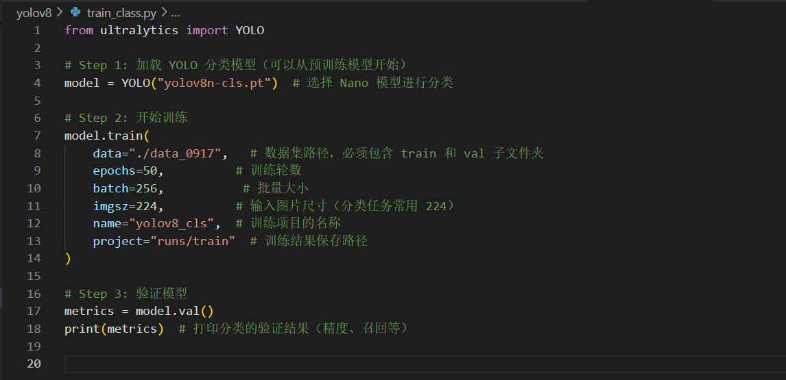
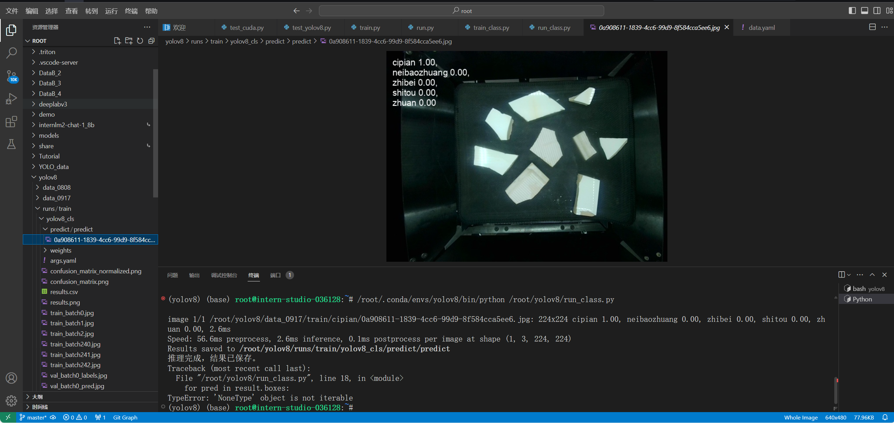

# 用 YOLOv 实现目标检测与识别
## 目录
1. 简介
2. 环境配置
3. 数据集准备
4. 模型训练
5. 实时推理
6. 总结

## 1. 简介
YOLOv（You Only Look Once version系列）是一种集目标检测、实例分割、分类等多种功能于一体的基于深度学习的实时物体检测算法，以单次前向传播即可预测物体类别、位置和分割掩码而著称，兼具高速度和准确性。本文将以 YOLOv8 为例，展示如何在自定义数据集上实现目标检测与识别，并进行模型评估和实时推理。
## 2. 环境配置
在使用 YOLOv8 之前，请确保已经配置以下环境：
- Python 版本：Python 3.8+
- 必备库：ultralytics, torch, numpy, opencv-python

然后再安装 YOLOv8 相关库：
pip install -U torch torchvision

验证安装


## 3. 数据集准备
### 3.1 目标检测数据集
- **目录结构：**
    ```plaintext
    dataset/
        ├── train/
        │   ├── images/
        │   ├── labels/
        ├── val/
        │   ├── images/
        │   ├── labels/
    ```
- **标签格式：**
    每个 `.txt` 文件对应一张图像：
    ```
    <class_id> <x_center> <y_center> <width> <height>
    ```
- 数据集工具推荐 [Roboflow](https://roboflow.com/)或者[LabelImg](https://github.com/tzutalin/labelImg)

### 3.2 目标识别数据集
- **目录结构：**
```
    dataset/
    ├── train/
    │   ├── class1/
    │   │   ├── img1.jpg
    │   │   ├── img2.jpg
    │   │   └── ...
    │   ├── class2/
    │   │   ├── img3.jpg
    │   │   └── ...
    │   └── ...
    ├── val/
    │   ├── class1/
    │   │   ├── img4.jpg
    │   │   └── ...
    │   ├── class2/
    │   │   ├── img5.jpg
    │   │   └── ...
    │   └── ...
```


## 4. 模型训练
### 4.1 目标检测
创建一个data.yaml文件，内容如下：

然后创建一个train.py文件，内容如下(参数可以自己调整)：


运行train.py文件，即可开始训练,训练效果如下：


训练效果图可以在保存目录下看到：


使用训练出来的模型进行推理,推理代码如下：


推理效果如下：


### 4.2 目标识别
目标识别的训练过程与目标检测的训练过程类似，且不需要data.yaml文件，只需要修改train.py文件即可，train.py文件如下(参数可以自己调整)：


训练效果如下：


训练效果图可以在保存目录下看到：


使用训练出来的模型进行推理,推理代码如下：


推理效果如下：


## 5. 总结
YOLOv8 是一个非常强大的目标检测与识别模型，在自定义数据集上实现目标检测与识别，并进行模型评估和实时推理，可以帮助我们快速完成目标检测与识别任务。